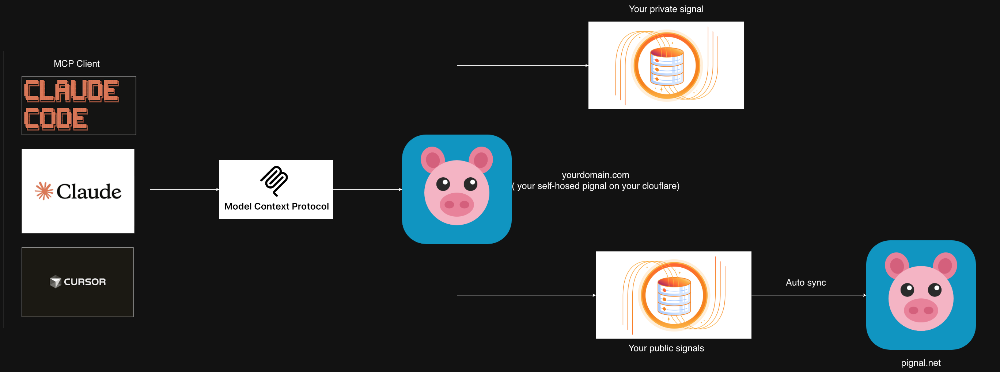
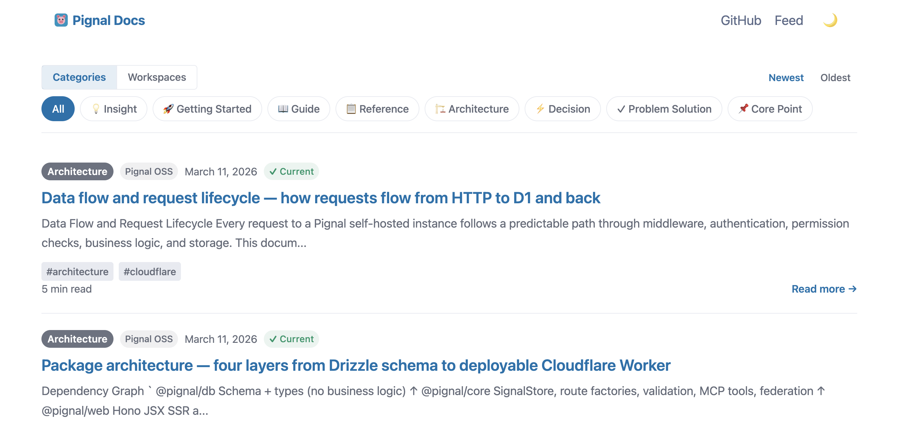
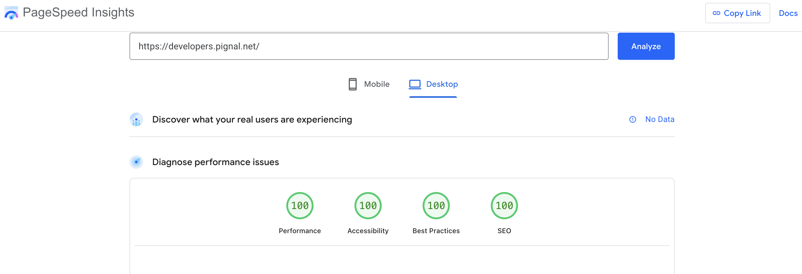

<p align="center">
  
</p>

<h1 align="center">Pignal — AI-native website platform powered by Cloudflare</h1>

<p align="center">
  <a href="./LICENSE"></a>
  <a href="https://developers.cloudflare.com/workers/"></a>
  <a href="https://www.typescriptlang.org/"></a>
  <a href="https://modelcontextprotocol.io/"></a>
</p>

One Worker, one database, any domain. Pignal gives you a production website — blog, wiki, shop, portfolio, recipes, and more — with a single deploy to Cloudflare Workers + D1.

**High-value websites** — a growing template library with built-in SEO, JSON-LD structured data, sitemaps, Atom feeds, and E-E-A-T validation. Every page is optimized from the moment it's published.

**AI-native** — every site is an MCP server. Manage the full content lifecycle — draft, publish, archive — from Claude, Cursor, or any MCP-compatible AI client.

**LLM-discoverable** — every site ships `llms.txt`, raw markdown endpoints, and structured data. Your content is natively readable by AI systems.

**Edge-first** — SSR at Cloudflare's 300+ edge locations with Lighthouse 100 scores and sub-50ms responses. Free tier compatible.

Open source (AGPL-3.0). Self-hosted, no third-party dependencies. **Your data, your code, yours to customize**.

---

<p align="center">
  
</p>

---

## What's Inside

- **Template system** — pluggable layouts (blog, shop, and more) with domain-specific vocabulary and styles
- **MCP server** — create structured content directly from Claude, mid-conversation
- **REST API** — full CRUD at `/api/*` with bearer token auth
- **Web dashboard** — manage items, types, workspaces, and settings at `/pignal`
- **Public source pages** — publish content with SEO-optimized HTML, JSON-LD, and Atom feeds

---

<p align="center">
  
</p>

<p align="center">
  <sub>Live at <a href="https://developers.pignal.net">developers.pignal.net</a></sub>
</p>

### Lighthouse scores (Desktop)

<p align="center">
  
</p>

<p align="center">
  
  
  
  
</p>

---

## Deploy

### Prerequisites

- [Node.js](https://nodejs.org/) 18+
- A free [Cloudflare account](https://dash.cloudflare.com/sign-up)

### 1. Clone and install

```bash
git clone https://github.com/pignal-net/pignal.git
cd pignal
pnpm install
```

### 2. Authenticate with Cloudflare

```bash
npx wrangler login
```

### 3. Create D1 database

```bash
cd server
npx wrangler d1 create pignal-server-db
```

Copy the `database_id` from the output.

### 4. Configure

```bash
cp wrangler.toml.example wrangler.toml
```

Edit `wrangler.toml` and replace the placeholder `database_id` with the value from step 3.

To use a non-default template, add `TEMPLATE = "shop"` (or your template name) under `[vars]` in `wrangler.toml`.

### 5. Set your secret token

```bash
openssl rand -hex 32
# Copy the output, then:
npx wrangler secret put SERVER_TOKEN
# Paste the token when prompted
```

### 6. Apply migrations and seed data

```bash
pnpm db:migrate:prod                                             # Create tables in production D1
npx wrangler d1 execute pignal-server-db --remote --file=../templates/seeds/blog.sql   # Seed blog template data
```

Replace `blog.sql` with `shop.sql` (or your template's seed file) if using a different template.

### 7. Deploy

```bash
pnpm run deploy              # Deploy the Worker
```

### 8. Verify

```bash
curl https://pignal-server.<your-subdomain>.workers.dev/health
```

---

## Connect Claude

### Claude Code (CLI)

```bash
claude mcp add --transport sse pignal \
  https://pignal-server.<your-subdomain>.workers.dev/mcp \
  --header "Authorization: Bearer <your-token>"
```

### Claude Desktop

Add to `claude_desktop_config.json` (requires [`mcp-remote`](https://github.com/geelen/mcp-remote)):

```json
{
  "mcpServers": {
    "pignal": {
      "command": "npx",
      "args": [
        "mcp-remote@latest",
        "https://pignal-server.<your-subdomain>.workers.dev/mcp",
        "--header",
        "Authorization: Bearer ${SERVER_TOKEN}"
      ],
      "env": {
        "SERVER_TOKEN": "<your-token>"
      }
    }
  }
}
```

### Project `.mcp.json`

```json
{
  "mcpServers": {
    "pignal": {
      "type": "sse",
      "url": "https://pignal-server.<your-subdomain>.workers.dev/mcp",
      "headers": {
        "Authorization": "Bearer ${SERVER_TOKEN}"
      }
    }
  }
}
```

---

## MCP Tools

| Tool | Description |
|------|-------------|
| `get_metadata` | Get types, workspaces, settings, and quality guidelines — **call first** |
| `save_item` | Capture an item from the current conversation |
| `list_items` | Browse items with filters (type, workspace, archived, visibility) |
| `search_items` | Full-text search across all items |
| `validate_item` | Record that you confirmed, applied, or revisited an item |
| `update_item` | Edit an existing item |
| `vouch_item` | Change item visibility (private/unlisted/vouched) |
| `batch_vouch_items` | Change visibility for multiple items at once |
| `create_workspace` | Create a new workspace |
| `create_type` | Create a new item type with validation actions |

Tool descriptions and field-level schema guidance adapt automatically to the active template (e.g., blog says "Signal saved!", shop says "Product created!").

---

## Templates

Pignal's template system lets you customize the layout, vocabulary, and MCP behavior for your domain. Two built-in templates ship out of the box:

| Template | Layout | Vocabulary | Use case |
|----------|--------|------------|----------|
| **blog** (default) | Vertical feed + article pages | signal, type, workspace | Knowledge base, blog, docs |
| **shop** | Sidebar + product grid | product, category, collection | Product catalog, portfolio |

### Switching templates

Set `TEMPLATE = "shop"` (or your template name) under `[vars]` in `wrangler.toml`, then redeploy.

### Creating a new template

1. Add a `TemplateConfig` in `templates/src/config.ts` — vocabulary, SEO hints, MCP instructions, and `schemaDescriptions`
2. Run `pnpm template:create <name>` from `templates/` to scaffold JSX components in `web/src/templates/<name>/`
3. Customize `source-page.tsx`, `item-post.tsx`, `layout.tsx`, and `styles.css`
4. (Optional) Add seed data in `templates/seeds/<name>.sql`

See [`templates/TEMPLATE_GUIDE.md`](./templates/TEMPLATE_GUIDE.md) for the full contract, prop types, and checklist.

---

## Architecture

```
pignal/
├── db/         @pignal/db         Drizzle ORM schemas + TypeScript types
├── core/       @pignal/core       ItemStore, route factories, MCP tools, validation, federation
├── templates/  @pignal/templates  Template configs, vocabulary, SEO, MCP config, seed SQL
├── web/        @pignal/web        Hono JSX SSR (admin dashboard + template JSX components)
└── server/     @pignal/server     Hono Worker with D1 storage + token auth
```

```
Request → Worker → Token Auth → Store Middleware → Route Handler → ItemStore → D1
```

- **@pignal/db** defines schemas: items (with visibility), item_types, type_actions, workspaces, settings
- **@pignal/core** implements `ItemStore` (pure business logic), route factories, Zod validation, MCP tools, and federation (`/.well-known/pignal`). Template-agnostic.
- **@pignal/templates** provides template configs (vocabulary, SEO, MCP instructions, schema descriptions), `Template` interface, prop types, and seed SQL. Adding a new template config = changes only here.
- **@pignal/web** provides admin dashboard (HTMX), template JSX components (blog, shop), and SEO-optimized source page (JSON-LD, OG tags, semantic HTML)
- **@pignal/server** wires everything: D1 storage, token auth, REST at `/api/*`, MCP at `/mcp`, web UI at `/`

## Federation

Every instance serves `/.well-known/pignal` with owner info, capabilities, and stats. Optionally register with [pignal.net](https://pignal.net) for directory listing and cross-instance discovery.

---

## Local Development

```bash
pnpm install
cd server
cp .dev.vars.example .dev.vars   # set SERVER_TOKEN
pnpm db:migrate                  # create tables in local D1
pnpm db:seed:blog                # seed blog template data (or db:seed:shop for shop)
pnpm dev                         # http://localhost:8787
```

After a fresh clone or when migrations are added, always run `pnpm db:migrate` before starting the dev server.

## Resource Usage

Runs within Cloudflare's free tier: 100K requests/day (Workers), 10 GB D1 storage, no egress charges.

## License

AGPL-3.0 — see [LICENSE](./LICENSE).
